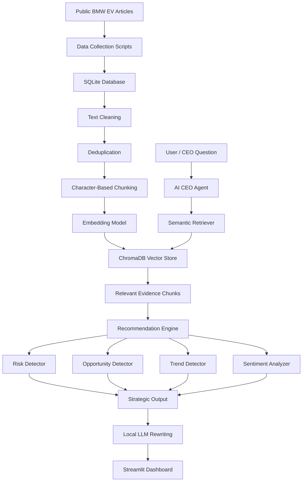

# AI CEO: Strategic Intelligence Agent for BMW EV Strategy

## Project Overview

This project is an **AI CEO Strategic Intelligence Agent** built for **BMW**.
The main goal is not only to retrieve information, but to convert public market information into useful CEO-level strategic advice.

The system collects public BMW EV-related articles, stores them in a database, processes and chunks the text, creates embeddings, retrieves relevant evidence, and generates strategic insights such as:

* Market intelligence
* Opportunities
* Risks
* Sentiment insights
* Strategic recommendations
* CEO briefing

The main business question behind this project is:

> If I were BMW’s CEO today, what should I do next in EV strategy and why?

---

## Selected Company

| Field      | Value                                            |
| ---------- | ------------------------------------------------ |
| Company    | BMW                                              |
| Industry   | Automotive / Electric Vehicles                   |
| Focus Area | BMW EV strategy and competitive intelligence     |
| Main Users | CEO / Strategy team / Management decision-makers |

---

## Data Collection Summary

The project uses public articles from multiple online sources related to BMW, electric vehicles, batteries, competitors, market risks, and EV strategy.

| Item                | Value                    |
| ------------------- | ------------------------ |
| Collected documents | 121 articles             |
| Public data sources | 3 sources                |
| Storage             | SQLite database          |
| Chunking method     | Character-based chunking |
| Total text chunks   | 628 chunks               |
| Chunk size          | 1000 characters          |
| Chunk overlap       | 150 characters           |

The collected data is stored in:

```text
data/ai_ceo.db
```

---

## System Architecture Diagram



---

## Data Flow Diagram


---

## Technology Stack

| Component            | Technology Used                                    |
| -------------------- | -------------------------------------------------- |
| Programming language | Python                                             |
| Dashboard            | Streamlit                                          |
| Database             | SQLite                                             |
| Embedding model      | sentence-transformers / all-MiniLM-L6-v2           |
| Vector database      | ChromaDB                                           |
| Local LLM            | Ollama with Qwen2.5:3B                             |
| NLP processing       | Text cleaning, deduplication, chunking, embeddings |
| Sentiment analysis   | VADER Sentiment                                    |
| Data handling        | pandas                                             |
| Version control      | Git and GitHub                                     |

---

## AI Pipeline

The project follows this AI pipeline:

```text
Collect → Store → Clean → Deduplicate → Chunk → Embed → Retrieve → Analyze → Recommend → Display
```

### 1. Data Collection

Public articles are collected from selected sources related to BMW and the EV market.
The collected documents are stored in SQLite so that the project has a structured and repeatable data layer.

### 2. Text Cleaning and Deduplication

The raw article text is cleaned to remove unnecessary spaces, noise, and repeated content.
Duplicates are removed so that the retrieval system does not repeatedly use the same article as evidence.

### 3. Chunking

The cleaned documents are split into smaller text chunks.

Current configuration:

| Setting       | Value           |
| ------------- | --------------- |
| Chunk size    | 1000 characters |
| Chunk overlap | 150 characters  |
| Total chunks  | 628             |

Character-based chunking is used because it keeps the chunks small enough for focused retrieval while preserving context through overlap.

### 4. Embedding Generation

Each chunk is converted into a vector embedding using:

```text
all-MiniLM-L6-v2
```

These embeddings allow the system to compare the user’s question with stored article chunks using semantic similarity.

### 5. Vector Store

The embeddings are stored in ChromaDB.
ChromaDB is used for semantic retrieval when the user asks a CEO-level question.

The generated vector store folder is:

```text
chroma_db/
```

This folder is generated locally and can be rebuilt using the build script.

### 6. Retrieval

When a user asks a question, the system retrieves the most relevant evidence chunks from ChromaDB.

Example questions:

```text
What should BMW do next in EV strategy?
What are BMW's biggest risks in the electric vehicle market?
What opportunities does BMW have from Neue Klasse?
How should BMW respond to Tesla and BYD competition?
```

### 7. Strategic Intelligence Engine

The retrieved evidence is analyzed to identify:

* Risks
* Opportunities
* Trends
* Recommended CEO actions
* Supporting evidence
* Confidence level

### 8. Local LLM Rewriting

A local open-source LLM is used through Ollama to rewrite the supported points into a more readable CEO-style response.

The LLM is not used as the only source of truth.
The final answer is based on retrieved evidence and rule-supported intelligence logic.

### 9. Dashboard

The Streamlit dashboard displays the final results in different sections:

* Company Overview
* Market Intelligence
* Opportunity Monitor
* Risk Monitor
* Sentiment Analysis
* Strategic Recommendations
* CEO Briefing

---

## Dashboard Sections

### 1. Company Overview

This section displays:

* Company name
* Industry
* Number of collected documents
* Number of data sources
* Last update timestamp

It also shows basic processing information such as text chunks and chunking configuration.

### 2. Market Intelligence

This section shows recent market information, competitor activities, technology trends, and important BMW-related updates.

### 3. Opportunity Monitor

This section identifies possible strategic opportunities for BMW.
The user can select a sample opportunity query or type a custom question.

### 4. Risk Monitor

This section identifies strategic, financial, operational, and competitive risks.
The user can select a sample risk query or type a custom question.

### 5. Sentiment Analysis

This section summarizes the sentiment of collected articles using VADER sentiment analysis.

### 6. Strategic Recommendations

This section gives evidence-based recommendations with:

* Recommendation
* Priority
* Supporting evidence
* Expected impact
* Risk level
* Risk assessment

### 7. CEO Briefing

This section gives a short executive briefing for management.
It is intentionally concise so that the CEO can quickly understand the situation, key risks, key opportunities, and next actions.

---

## Design Decisions

### 1. SQLite for structured storage

SQLite was selected because it is simple, lightweight, and suitable for a student prototype.
It allows the project to store documents, chunks, and recommendation-related data without requiring an external database server.

### 2. ChromaDB for semantic search

ChromaDB was used as the vector store because it works well with embeddings and supports semantic retrieval.
This is important because CEO questions may not use the exact same words as the collected articles.

### 3. Character-based chunking

The project uses character-based chunking instead of keeping full articles as one document.
This improves retrieval precision because the system can retrieve only the most relevant part of an article.

### 4. Local open-source LLM

The project uses a local model through Ollama instead of relying on a paid commercial API.
This matches the project requirement of using freely accessible or open-source models.

### 5. Evidence-based recommendation logic

The system does not simply generate advice from the LLM.
It first retrieves evidence, detects risks and opportunities, and then generates recommendations based on that evidence.

This makes the output more explainable and reduces hallucination risk.

### 6. Modular code structure

The project is divided into separate folders for:

* data collection
* data processing
* storage
* vector store
* intelligence engine
* LLM integration
* dashboard tabs

This makes the project easier to explain, debug, and extend during live coding.

---

## Project Folder Structure

```text
ai_ceo_agent/
│
├── app.py
├── README.md
├── requirements.txt
│
├── agents/
│   └── ceo_agent.py
│
├── dashboard/
│   ├── common.py
│   └── tabs/
│       ├── overview_tab.py
│       ├── market_tab.py
│       ├── opportunity_tab.py
│       ├── risk_tab.py
│       ├── sentiment_tab.py
│       ├── recommendations_tab.py
│       └── ceo_briefing_tab.py
│
├── data/
│   ├── ai_ceo.db
│   └── source_plan.csv
│
├── data_collection/
│   └── collect_final_three_sources.py
│
├── data_processing/
│   ├── clean_text.py
│   ├── deduplicate.py
│   ├── chunk_documents.py
│   └── chunk_documents_char.py
│
├── intelligence_engine/
│   ├── opportunity_detector.py
│   ├── risk_detector.py
│   ├── trend_detector.py
│   ├── sentiment_analyzer.py
│   └── recommendation_engine.py
│
├── llm/
│   └── ollama_client.py
│
├── storage/
│   └── sqlite_store.py
│
├── utils/
│   └── config.py
│
├── vector_store/
│   ├── build_chroma.py
│   └── retriever.py
│
└── scripts/
    └── checks/
        ├── check_chunks.py
        └── check_database.py
```

---

## How to Run the Project

### 1. Create and activate virtual environment

```powershell
python -m venv .venv
.\.venv\Scripts\Activate.ps1
```

### 2. Install requirements

```powershell
pip install -r requirements.txt
```

### 3. Check the database

```powershell
python scripts/checks/check_database.py
```

### 4. Check chunks

```powershell
python scripts/checks/check_chunks.py
```

### 5. Rebuild vector store if needed

If the `chroma_db/` folder is not available, rebuild it using:

```powershell
python -m vector_store.build_chroma
```

### 6. Run the dashboard

```powershell
streamlit run app.py
```

---

## Important Note About ChromaDB

The `chroma_db/` folder is a generated vector database folder.
It is not required to push this folder to GitHub because it can be recreated from the stored chunks.

To recreate it:

```powershell
python -m vector_store.build_chroma
```

---

## Example CEO Questions

```text
What should BMW do next in EV strategy?
What are BMW's biggest risks in the electric vehicle market?
What opportunities does BMW have from Neue Klasse?
How should BMW respond to Tesla and BYD competition?
What battery and charging trends should BMW focus on?
```

---

## Current Limitations

This is a working academic prototype, so there are some limitations:

* The system uses public articles only.
* The intelligence depends on the collected dataset.
* The local LLM is used for rewriting and may not be as strong as large commercial models.
* The recommendation engine is designed for explainable prototype logic, not full enterprise strategy automation.
* The vector database needs to be rebuilt if the ChromaDB folder is not included.

---

## Future Improvements

Possible improvements include:

* Add more public sources.
* Add scheduled data collection.
* Add better source reliability scoring.
* Add more detailed competitor comparison.
* Add time-based trend analysis.
* Improve recommendation ranking using stronger scoring logic.
* Add downloadable CEO report generation.

---

## Conclusion

This project demonstrates how NLP, retrieval, embeddings, vector databases, and local LLMs can be combined to build a strategic intelligence assistant.

The final system helps transform public BMW EV-related information into evidence-based risks, opportunities, recommendations, and CEO-level briefings.
