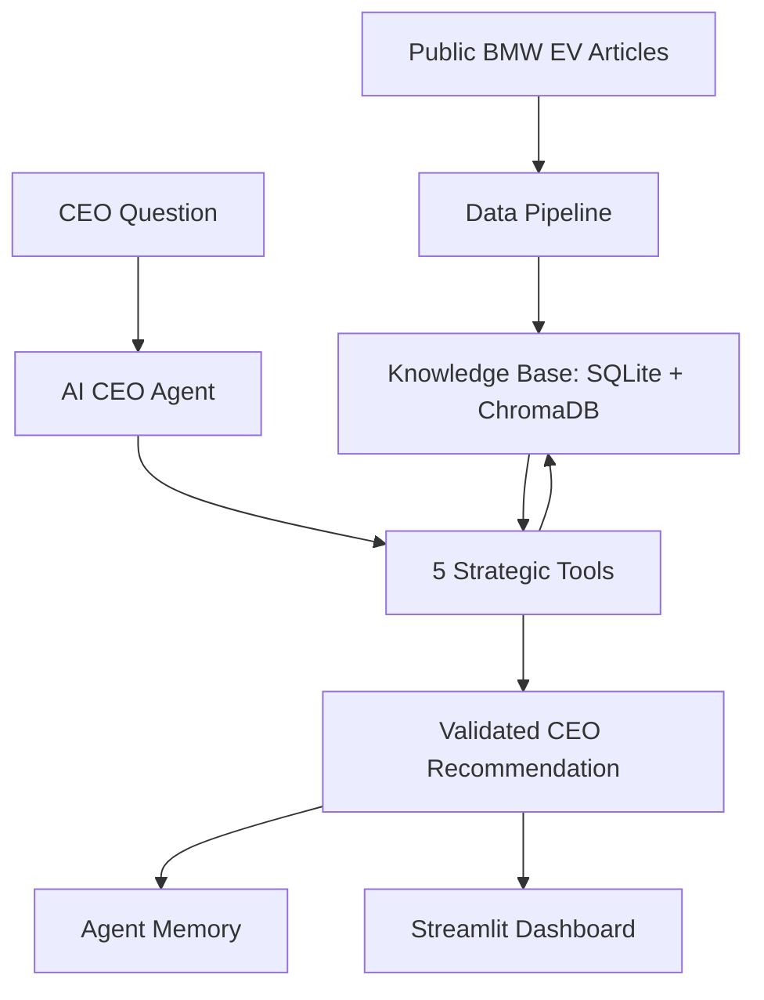

# AI CEO Strategic Intelligence Agent for BMW EV Strategy

## 1. Project Overview

This project is an **AI CEO Strategic Intelligence Agent** built for **BMW EV strategy and competitive intelligence**.

The goal of this project is to convert public BMW EV-related information into **CEO-level strategic recommendations**. The system collects public articles, stores them in a database, builds a searchable knowledge base, retrieves relevant evidence, analyzes strategic signals, and generates an evidence-based CEO briefing.

The main business question is:

> If I were BMW’s CEO today, what should I do next in EV strategy and why?

The project focuses on:

* BMW EV strategy
* Neue Klasse platform
* BMW iX3 / i3 electric vehicle positioning
* Battery range and charging trends
* EV competition from Tesla, BYD, and other automakers
* China sales and profit pressure
* Strategic risks, opportunities, trends, sentiment, and CEO actions

---

## 2. Selected Company and Scope

| Field       | Value                                           |
| ----------- | ----------------------------------------------- |
| Company     | BMW                                             |
| Industry    | Automotive / Electric Vehicles                  |
| Focus Area  | BMW EV strategy and competitive intelligence    |
| Main User   | CEO / Strategy team / Management decision-maker |
| Main Output | Evidence-based CEO recommendation and briefing  |

---

## 3. Project Requirements Mapping

| Requirement                                   | Current Implementation                               |
| --------------------------------------------- | ---------------------------------------------------- |
| Select one public company                     | BMW                                                  |
| Collect at least 100 documents/articles/posts | 121 collected articles                               |
| Use at least 3 public sources                 | BMWBlog, Electrek, CleanTechnica                     |
| Automatic data collection                     | Script-based public article collection               |
| Store collected information                   | SQLite database                                      |
| Clean and process text                        | Text cleaning, deduplication, and chunking           |
| Create searchable knowledge repository        | SQLite + ChromaDB                                    |
| Generate embeddings                           | all-MiniLM-L6-v2                                     |
| Retrieval mechanism                           | Semantic search / RAG                                |
| AI CEO Agent                                  | One main AI CEO Agent                                |
| Agent planning                                | `agent/planner.py`                                   |
| Agent tools                                   | 5 strategic tools                                    |
| Agent validation                              | `agent/validator.py`                                 |
| Agent memory                                  | `agent/memory.py` with SQLite                        |
| Dashboard                                     | Streamlit executive dashboard                        |
| Open-source / freely accessible model         | Ollama with Qwen2.5:3B, optional for final rewriting |

---

## 4. Dataset Summary

The project uses public articles related to BMW, electric vehicles, competitors, battery technology, charging, market risks, and strategic opportunities.

| Item                | Value                            |
| ------------------- | -------------------------------- |
| Collected documents | 121 articles                     |
| Public sources      | 3 sources                        |
| Sources             | BMWBlog, Electrek, CleanTechnica |
| Storage             | SQLite database                  |
| Total text chunks   | 886 chunks                       |
| Chunk size          | 1000 characters                  |
| Chunk overlap       | 150 characters                   |
| Vector database     | ChromaDB                         |
| Embedding model     | all-MiniLM-L6-v2                 |

Main database file:

```text
data/ai_ceo.db
```

The dashboard does not scrape websites live every time it opens. It works over the stored and indexed knowledge base.

---

## 5. Simple System Architecture



### Architecture Explanation

The architecture is kept simple and explainable.

Public BMW EV-related articles are collected and processed through a data pipeline. The processed documents are stored in SQLite, while embeddings are stored in ChromaDB for semantic retrieval.

When a CEO question is asked, the AI CEO Agent creates a plan, selects the required strategic tools, retrieves evidence from the knowledge base, analyzes risks, opportunities, trends and sentiment, generates a CEO-level recommendation, validates the answer, saves the run in memory, and displays the result in the Streamlit dashboard.

---

## 6. Main Pipeline

The final pipeline is:

```text
Collect Data → Store → Clean → Chunk → Embed → Retrieve → Analyze → Recommend → Validate → Save Memory → Display
```

### 6.1 Data Collection

Public BMW EV-related articles are collected from selected public sources.

Sources used:

```text
BMWBlog
Electrek
CleanTechnica
```

### 6.2 Storage

Collected articles and processed chunks are stored in SQLite.

```text
data/ai_ceo.db
```

### 6.3 Text Processing

The text processing step includes:

* cleaning noisy text
* removing duplicate content
* splitting documents into chunks

Current chunking configuration:

| Setting       | Value           |
| ------------- | --------------- |
| Chunk size    | 1000 characters |
| Chunk overlap | 150 characters  |
| Total chunks  | 886 chunks      |

### 6.4 Embeddings

Each chunk is converted into a vector embedding using:

```text
all-MiniLM-L6-v2
```

This allows semantic search. The system can retrieve relevant chunks even if the user question does not use the exact same words as the article.

### 6.5 Vector Store

The embeddings are stored in ChromaDB.

ChromaDB is used as the searchable vector knowledge base.

### 6.6 Retrieval

When a CEO question is asked, the system retrieves the most relevant evidence chunks from ChromaDB.

### 6.7 Agentic Reasoning

The AI CEO Agent uses retrieved evidence, strategic tools, validation, and memory to produce an evidence-based recommendation.

### 6.8 Dashboard

The final output is shown in the Streamlit dashboard.

---

## 7. AI CEO Agent Design

The project uses **one main AI CEO Agent**.

This design was chosen to keep the system simple, explainable, and suitable for an academic prototype.

Main agent file:

```text
agent/ai_ceo_agent.py
```

The AI CEO Agent performs the following steps:

1. Receives the CEO question.
2. Creates a plan.
3. Selects the required tools.
4. Retrieves relevant evidence.
5. Analyzes risks, opportunities, trends, and sentiment.
6. Generates a CEO-level recommendation.
7. Validates the recommendation.
8. Saves the run in memory.
9. Returns the final CEO briefing.
10. Shows the full trace in the dashboard.

---

## 8. Why This Is an Agent

The previous version of the project was mainly a RAG pipeline. The improved version adds explicit agentic behavior.

| Agentic Feature      | Implementation                      |
| -------------------- | ----------------------------------- |
| Goal understanding   | User CEO question                   |
| Planning             | `agent/planner.py`                  |
| Tool selection       | Selected tools shown in Agent Trace |
| Tool execution       | Executed tools shown in Agent Trace |
| Decision trace       | Agent decisions shown in dashboard  |
| Evidence retrieval   | ChromaDB semantic search            |
| Strategic analysis   | `analysis_tool`                     |
| Validation           | `agent/validator.py`                |
| Memory               | `agent/memory.py`                   |
| Multi-step execution | `agent/ai_ceo_agent.py`             |
| Dashboard proof      | `dashboard/tabs/agent_trace_tab.py` |

This is not only RAG because the system does more than retrieve and answer. It plans, selects tools, executes tools, validates the output, saves memory, and shows the full agent trace.

---

## 9. Agent Tools

The AI CEO Agent uses **5 strategic tools**.

Tool file:

```text
tools/strategic_tools.py
```

| Tool                   | Purpose                                         |
| ---------------------- | ----------------------------------------------- |
| `search_evidence_tool` | Retrieves relevant evidence from ChromaDB       |
| `analysis_tool`        | Extracts risks, opportunities, and trends       |
| `sentiment_tool`       | Calculates evidence sentiment using VADER       |
| `recommendation_tool`  | Generates CEO-level strategic recommendation    |
| `validation_tool`      | Checks whether the output is evidence-supported |

Memory is handled separately by:

```text
agent/memory.py
```

Memory stores the agent run in SQLite, including the question, query type, selected tools, executed tools, validation status, confidence, and final briefing.

---

## 10. Knowledge Base

The knowledge base has two parts:

| Component | Role                                                          |
| --------- | ------------------------------------------------------------- |
| SQLite    | Stores collected articles, chunks, metadata, and agent memory |
| ChromaDB  | Stores embeddings and supports semantic retrieval             |

This combination allows the system to store structured data and also perform semantic search.

---

## 11. Dashboard Sections

The Streamlit dashboard contains 8 sections.

| Tab                 | Purpose                                                                                |
| ------------------- | -------------------------------------------------------------------------------------- |
| Overview            | Shows project statistics and source summary                                            |
| Market Intelligence | Shows BMW EV-related market information                                                |
| Opportunities       | Shows strategic opportunities                                                          |
| Risk Monitor        | Shows strategic risks                                                                  |
| Sentiment           | Shows article-level sentiment analysis                                                 |
| Recommendations     | Shows strategic recommendations                                                        |
| CEO Briefing        | Shows concise executive briefing                                                       |
| Agent Trace         | Shows planning, tool selection, execution, decisions, validation, memory, and evidence |

The most important tab for explaining the agent is:

```text
Agent Trace
```

This tab demonstrates the agentic workflow clearly.

---

## 12. Technology Stack

| Component                  | Technology                                       |
| -------------------------- | ------------------------------------------------ |
| Programming language       | Python                                           |
| Dashboard                  | Streamlit                                        |
| Database                   | SQLite                                           |
| Vector database            | ChromaDB                                         |
| Embedding model            | sentence-transformers / all-MiniLM-L6-v2         |
| Retrieval                  | Semantic search / RAG                            |
| Sentiment analysis         | VADER Sentiment                                  |
| Local LLM                  | Ollama with Qwen2.5:3B                           |
| Data handling              | pandas                                           |
| Visualization              | Streamlit / Plotly                               |
| Article collection support | requests, BeautifulSoup, feedparser, trafilatura |
| Version control            | Git and GitHub                                   |

---

## 13. Project Folder Structure

```text
ai_ceo_agent/
│
├── app.py
├── README.md
├── requirements.txt
│
├── agent/
│   ├── __init__.py
│   ├── ai_ceo_agent.py
│   ├── planner.py
│   ├── validator.py
│   └── memory.py
│
├── tools/
│   ├── __init__.py
│   └── strategic_tools.py
│
├── intelligence/
│   ├── __init__.py
│   └── strategic_analyzer.py
│
├── retrieval/
│   ├── __init__.py
│   ├── build_vector_store.py
│   └── semantic_retriever.py
│
├── dashboard/
│   ├── __init__.py
│   ├── common.py
│   └── tabs/
│       ├── __init__.py
│       ├── overview_tab.py
│       ├── market_tab.py
│       ├── opportunity_tab.py
│       ├── risk_tab.py
│       ├── sentiment_tab.py
│       ├── recommendations_tab.py
│       ├── ceo_briefing_tab.py
│       └── agent_trace_tab.py
│
├── data_collection/
│   ├── __init__.py
│   └── collect_articles.py
│
├── processing/
│   └── __init__.py
│
├── storage/
│   ├── __init__.py
│   └── sqlite_store.py
│
├── llm/
│   ├── __init__.py
│   └── ollama_client.py
│
├── data/
│   └── ai_ceo.db
│
├── scripts/
│   └── checks/
│       ├── check_chunks.py
│       └── check_database.py
│
├── utils/
│   ├── __init__.py
│   └── config.py
│
└── archive_old/
    └── old duplicate folders kept only as backup
```

The active project uses the clean folders above. The `archive_old/` folder is only kept as backup and is not part of the active pipeline.

---

## 14. Important Files and Responsibilities

| File                                 | Responsibility                              |
| ------------------------------------ | ------------------------------------------- |
| `app.py`                             | Main Streamlit dashboard entry point        |
| `agent/ai_ceo_agent.py`              | Main AI CEO Agent                           |
| `agent/planner.py`                   | Creates plan and selects tools              |
| `agent/validator.py`                 | Validates final recommendation              |
| `agent/memory.py`                    | Saves agent runs in SQLite                  |
| `tools/strategic_tools.py`           | Contains the 5 tools used by the agent      |
| `intelligence/strategic_analyzer.py` | Strategic analysis and recommendation logic |
| `retrieval/semantic_retriever.py`    | Retrieves relevant chunks from ChromaDB     |
| `retrieval/build_vector_store.py`    | Builds the ChromaDB vector store            |
| `dashboard/tabs/agent_trace_tab.py`  | Displays the full agent trace               |
| `llm/ollama_client.py`               | Connects to local Ollama LLM                |
| `storage/sqlite_store.py`            | SQLite helper functions                     |

---

## 15. How to Run the Project

### Step 1: Create virtual environment

```powershell
python -m venv .venv
```

### Step 2: Activate virtual environment

```powershell
.\.venv\Scripts\Activate.ps1
```

### Step 3: Install dependencies

```powershell
pip install -r requirements.txt
```

### Step 4: Set Python path

```powershell
$env:PYTHONPATH = "."
```

### Step 5: Check database

```powershell
python scripts/checks/check_database.py
```

### Step 6: Check chunks

```powershell
python scripts/checks/check_chunks.py
```

### Step 7: Rebuild vector store if needed

If the `chroma_db/` folder is missing or needs to be rebuilt, run:

```powershell
python -m retrieval.build_vector_store
```

### Step 8: Test planner

```powershell
python -m agent.planner
```

### Step 9: Test tools

```powershell
python -m tools.strategic_tools
```

### Step 10: Test AI CEO Agent

```powershell
python -m agent.ai_ceo_agent
```

### Step 11: Compile check

```powershell
python -m compileall app.py agent tools intelligence retrieval dashboard llm storage utils
```

### Step 12: Run dashboard

```powershell
streamlit run app.py
```

---

## 16. Example CEO Questions

The system can answer questions such as:

```text
What should BMW do next in EV strategy?
What are BMW's biggest risks in the EV market?
What opportunities does BMW have from Neue Klasse?
How should BMW respond to Tesla and BYD competition?
What battery and charging trends should BMW focus on?
What is the evidence sentiment around BMW EV strategy?
```

---

## 17. Example Agent Workflow

For the question:

```text
What are BMW's biggest risks in the EV market?
```

The AI CEO Agent performs the following workflow:

1. Classifies the question as risk analysis.
2. Creates a plan.
3. Selects 5 tools.
4. Retrieves relevant evidence from ChromaDB.
5. Analyzes risks, opportunities, and trends.
6. Calculates evidence sentiment.
7. Generates a CEO-level recommendation.
8. Validates the output.
9. Saves the run in memory.
10. Displays the result in the dashboard.

Example selected tools:

```text
search_evidence_tool
analysis_tool
sentiment_tool
recommendation_tool
validation_tool
```

---

## 18. Explainability and Hallucination Control

The system reduces hallucination risk by using an evidence-first approach.

The LLM is not used as the only source of truth. The system first retrieves relevant evidence, extracts supported risks and opportunities, generates actions from the retrieved evidence, and validates the final response.

The local LLM is optional and mainly used for rewriting the final response into a more readable CEO-style briefing.

If LLM rewriting is not used, the system still produces a rule-based evidence-supported recommendation.

---

## 19. Design Decisions

### 19.1 One main agent instead of many agents

The project uses one main AI CEO Agent to avoid unnecessary complexity. This makes the system easier to explain during viva and easier to debug during live coding.

### 19.2 Five strategic tools

The system uses only five tools to keep the design clean:

1. Evidence search
2. Strategic analysis
3. Sentiment analysis
4. Recommendation generation
5. Validation

### 19.3 SQLite for storage

SQLite was selected because it is lightweight and suitable for an academic prototype. It stores articles, chunks, and agent memory without requiring a separate database server.

### 19.4 ChromaDB for semantic retrieval

ChromaDB was selected because it supports embedding-based retrieval. This is useful because CEO questions may not use the same words as the articles.

### 19.5 all-MiniLM-L6-v2 for embeddings

The project uses `all-MiniLM-L6-v2` because it is lightweight, fast, and suitable for semantic search in a student prototype.

### 19.6 VADER for sentiment analysis

VADER is used because it is simple, explainable, and suitable for article-level sentiment analysis.

### 19.7 Ollama for local LLM rewriting

Ollama with Qwen2.5:3B is used as an optional local LLM. This avoids dependency on paid APIs and keeps the project aligned with open-source / freely accessible model requirements.

---

## 20. Current Limitations

This is an academic prototype, so there are some limitations:

1. The system uses public articles only.
2. The data collection is script-based, not continuous live scraping.
3. The quality of recommendations depends on the collected dataset.
4. The local LLM is used mainly for rewriting, not as the only reasoning engine.
5. The strategic analysis uses explainable rule-supported logic, not enterprise-grade forecasting.
6. The vector store may need to be rebuilt if `chroma_db/` is missing.
7. The system is designed for demonstration and learning, not production deployment.

---

## 21. Future Improvements

Possible future improvements include:

* Add more public sources.
* Add scheduled data collection.
* Add source reliability scoring.
* Add time-based trend analysis.
* Add deeper competitor comparison.
* Add hybrid search using keyword search plus semantic search.
* Add downloadable CEO report generation.
* Add visual evidence graph.
* Improve recommendation ranking.
* Add automated evaluation for retrieved evidence quality.

---

## 22. Viva Explanation

A concise explanation for viva:

```text
My project is an AI CEO Strategic Intelligence Agent for BMW EV strategy.

The system collects public BMW EV-related articles, stores them in SQLite, chunks the text, creates embeddings using all-MiniLM-L6-v2, and stores them in ChromaDB. When a CEO question is asked, the AI CEO Agent creates a plan, selects five tools, retrieves evidence, analyzes risks, opportunities, trends and sentiment, generates a recommendation, validates the output, saves the run in memory, and displays the full trace in the dashboard.

This is not only a RAG pipeline because the system shows planning, tool selection, tool execution, decision trace, validation, and memory.
```

---

## 23. Conclusion

This project demonstrates how NLP, RAG, embeddings, vector databases, local LLMs, strategic analysis, and a Streamlit dashboard can be combined to build an AI CEO Strategic Intelligence Agent.

The final system converts public BMW EV-related information into evidence-based risks, opportunities, trends, sentiment, strategic recommendations, and CEO-level briefings.
