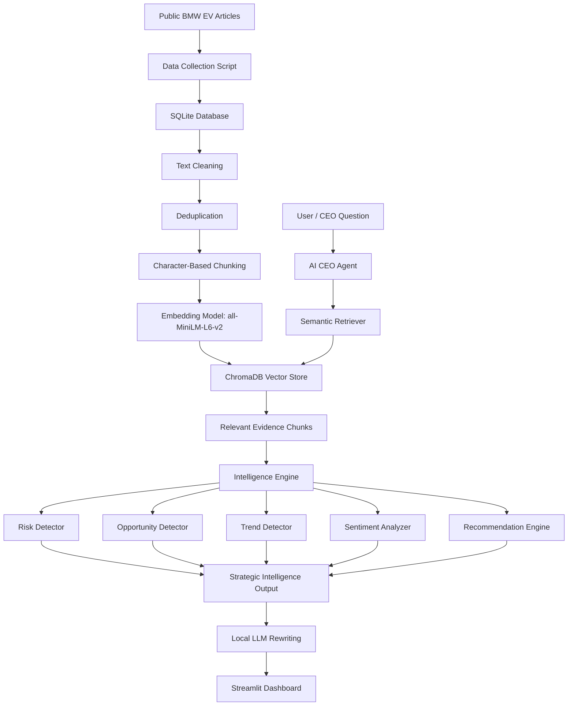

# AI CEO: Strategic Intelligence Agent for BMW EV Strategy

## 1. Project Overview

This project is an **AI CEO Strategic Intelligence Agent** built for **BMW**.

The purpose of this project is not only to retrieve information, but to convert public market information into **CEO-level strategic recommendations**. The system collects public BMW EV-related articles, stores them in a database, processes the text, builds a semantic search index, retrieves relevant evidence, and generates strategic insights.

The main business question behind this project is:

> If I were BMW’s CEO today, what should I do next in EV strategy and why?

The system focuses on:

* BMW EV strategy
* Neue Klasse platform
* BMW iX3 / i3 electric vehicle positioning
* Battery range and charging trends
* EV competition from Tesla, BYD, and other automakers
* China sales and profit pressure
* Strategic risks, opportunities, trends, and CEO actions

---

## 2. Selected Company and Scope

| Field      | Value                                           |
| ---------- | ----------------------------------------------- |
| Company    | BMW                                             |
| Industry   | Automotive / Electric Vehicles                  |
| Focus Area | BMW EV strategy and competitive intelligence    |
| Main User  | CEO / Strategy team / Management decision-maker |

---

## 3. Project Requirements Mapping

| Requirement                                   | Current Implementation                                                    |
| --------------------------------------------- | ------------------------------------------------------------------------- |
| Select one public company                     | BMW                                                                       |
| Collect at least 100 documents/articles/posts | 121 collected articles                                                    |
| Use at least 3 public sources                 | BMWBlog, Electrek, CleanTechnica                                          |
| Automatic collection process                  | Script-based public article collection                                    |
| Store collected information                   | SQLite database                                                           |
| Clean and process text                        | Custom cleaning and deduplication scripts                                 |
| Generate embeddings                           | all-MiniLM-L6-v2                                                          |
| Build searchable repository                   | ChromaDB vector store                                                     |
| Retrieval mechanism                           | RAG / semantic search                                                     |
| Strategic intelligence engine                 | Risk, opportunity, trend, sentiment, and recommendation modules           |
| Open-source/freely accessible model           | Ollama with Qwen2.5:3B                                                    |
| Dashboard                                     | Streamlit executive dashboard                                             |
| Architecture documentation                    | README with diagrams, technology stack, design decisions, and AI pipeline |

---

## 4. Data Collection Summary

The project uses public articles from sources related to BMW, electric vehicles, competitors, market risks, EV charging, batteries, and strategic opportunities.

| Item                | Value                    |
| ------------------- | ------------------------ |
| Collected documents | 121 articles             |
| Public data sources | 3 sources                |
| Storage             | SQLite database          |
| Chunking method     | Character-based chunking |
| Total text chunks   | 886 chunks               |
| Chunk size          | 1000 characters          |
| Chunk overlap       | 150 characters           |
| Vector database     | ChromaDB                 |

The main database file is:

```text
data/ai_ceo.db
```

The data collection is script-based and rerunnable. The dashboard does not scrape websites live every time it opens. Instead, it performs dynamic RAG-based analysis over the stored and indexed knowledge base.

---

## 5. System Architecture Diagram



---

## 6. Data Flow Diagram


---

## 7. Technology Stack

| Component                               | Technology Used                                  |
| --------------------------------------- | ------------------------------------------------ |
| Programming language                    | Python                                           |
| Dashboard                               | Streamlit                                        |
| Database                                | SQLite                                           |
| Embedding model                         | sentence-transformers / all-MiniLM-L6-v2         |
| Vector database                         | ChromaDB                                         |
| Local LLM                               | Ollama with Qwen2.5:3B                           |
| Retrieval method                        | RAG / semantic search                            |
| Sentiment analysis                      | VADER Sentiment                                  |
| Data handling                           | pandas                                           |
| Article extraction / collection support | requests, BeautifulSoup, feedparser, trafilatura |
| Version control                         | Git and GitHub                                   |

---

## 8. AI Pipeline

The project follows this AI pipeline:

```text
Collect → Store → Clean → Deduplicate → Chunk → Embed → Retrieve → Analyze → Recommend → Display
```

### 8.1 Data Collection

Public BMW EV-related articles are collected from selected public sources. The collected information is stored in SQLite so that the system has a repeatable data layer.

### 8.2 Text Cleaning

The raw article content is cleaned to remove extra spaces, unnecessary formatting, and noisy text.

### 8.3 Deduplication

Duplicate or repeated articles are removed so that the same source is not repeatedly used as evidence.

### 8.4 Chunking

The cleaned documents are split into smaller text chunks.

Current chunking configuration:

| Setting       | Value           |
| ------------- | --------------- |
| Chunk size    | 1000 characters |
| Chunk overlap | 150 characters  |
| Total chunks  | 886 chunks      |

Character-based chunking is used because it keeps retrieval focused while overlap preserves context between neighbouring chunks.

### 8.5 Embedding Generation

Each chunk is converted into a vector embedding using:

```text
all-MiniLM-L6-v2
```

This allows semantic comparison between a user question and stored article chunks.

### 8.6 Vector Storage

The embeddings are stored in ChromaDB. ChromaDB is used to retrieve the most relevant evidence chunks for a CEO-level question.

### 8.7 Retrieval

When the user asks a question, the system retrieves top relevant chunks from ChromaDB using semantic similarity.

Example questions:

```text
What should BMW do next in EV strategy?
What are BMW's biggest risks in the electric vehicle market?
What opportunities does BMW have from Neue Klasse?
How should BMW respond to Tesla and BYD competition?
What battery and charging trends should BMW focus on?
```

### 8.8 Strategic Intelligence Analysis

The retrieved evidence is passed to the intelligence engine. The intelligence engine identifies:

* Risks
* Opportunities
* Trends
* Sentiment
* Recommended actions
* Supporting evidence
* Confidence level

### 8.9 Local LLM Rewriting

A local open-source LLM through Ollama is used to rewrite supported points into a more readable CEO-style response.

The LLM is not used as the only source of truth. The final output is based on retrieved evidence and rule-supported intelligence logic.

### 8.10 Dashboard Display

The final output is displayed in the Streamlit executive dashboard.

---

## 9. RAG Pipeline

The project uses Retrieval-Augmented Generation.

The main RAG logic is implemented across these modules:

```text
vector_store/build_chroma.py
vector_store/retriever.py
agents/ceo_agent.py
intelligence_engine/recommendation_engine.py
```

A separate `rag_pipeline/` folder is also included as a step-wise wrapper for demo, testing, and live coding. It does not replace the existing working logic. It makes the RAG process easier to explain.

### RAG Flow

```text
SQLite chunks
    ↓
Embedding generation
    ↓
ChromaDB vector store
    ↓
User CEO question
    ↓
Semantic retrieval
    ↓
Top-K evidence chunks
    ↓
AI CEO Agent
    ↓
Strategic intelligence engine
    ↓
CEO recommendation / briefing
```

### RAG Pipeline Folder

```text
rag_pipeline/
├── __init__.py
├── indexing_pipeline.py
├── query_pipeline.py
├── rag_orchestrator.py
└── README.md
```

### RAG Pipeline Commands

Rebuild or run indexing wrapper:

```powershell
python -m rag_pipeline.indexing_pipeline
```

Test query pipeline:

```powershell
python -m rag_pipeline.query_pipeline
```

Run full RAG demo:

```powershell
python -m rag_pipeline.rag_orchestrator
```

---

## 10. Intelligence Engine

The intelligence engine converts retrieved evidence into strategic insights.

```text
intelligence_engine/
├── risk_detector.py
├── opportunity_detector.py
├── trend_detector.py
├── sentiment_analyzer.py
└── recommendation_engine.py
```

### 10.1 Risk Detector

`risk_detector.py` identifies risk signals such as:

* China sales and profit pressure
* Competitive pressure from Tesla, BYD, and other EV rivals
* Battery and charging execution risk
* EV transition risk
* Regulatory and policy risk

### 10.2 Opportunity Detector

`opportunity_detector.py` identifies opportunity signals such as:

* Neue Klasse EV momentum
* Range and charging as differentiators
* Premium performance EV positioning
* Smart charging and energy services
* Market share growth from EV demand

### 10.3 Trend Detector

`trend_detector.py` identifies high-level trends such as:

* EV adoption and market demand
* Charging infrastructure importance
* Battery and range competition
* Stronger EV competition
* Regional policy and market pressure
* BMW EV platform development

### 10.4 Sentiment Analyzer

`sentiment_analyzer.py` uses VADER sentiment analysis to understand the tone of collected articles.

### 10.5 Recommendation Engine

`recommendation_engine.py` combines retrieved evidence, detected risks, opportunities, trends, and actions into CEO-level strategic recommendations.

---

## 11. Dashboard Sections

The Streamlit dashboard contains seven main sections.

### 11.1 Company Overview

Displays:

* Company name
* Industry
* Number of collected documents
* Number of data sources
* Last update timestamp

### 11.2 Market Intelligence

Displays:

* Recent news
* Competitor activities
* Emerging technologies
* Important BMW-related updates

### 11.3 Opportunity Monitor

Displays:

* Opportunity title
* Impact level
* Evidence
* Confidence score

The user can select a sample opportunity query or type a custom question.

### 11.4 Risk Monitor

Displays:

* Risk title
* Risk category
* Severity level
* Evidence
* Confidence score

The user can select a sample risk query or type a custom question.

### 11.5 Sentiment Analysis

Displays:

* News sentiment
* Sentiment by source
* Sentiment by category
* Document-level sentiment

### 11.6 Strategic Recommendations

Displays:

* Recommendation
* Priority
* Supporting evidence
* Expected impact
* Risk level
* Risk assessment

### 11.7 CEO Briefing

Generates a short executive summary answering:

* What happened?
* Why does it matter?
* What should management do next?

The CEO briefing is intentionally concise so that a decision-maker can quickly understand the situation, risks, opportunities, and recommended next steps.

---

## 12. Design Decisions

### 12.1 SQLite for structured storage

SQLite was selected because it is simple, lightweight, and suitable for a student prototype. It stores collected articles, processed chunks, and related metadata without needing an external database server.

### 12.2 ChromaDB for semantic search

ChromaDB was used as the vector store because it supports embedding-based semantic retrieval. This is important because a CEO question may not use the exact same words as the collected articles.

### 12.3 Character-based chunking

Character-based chunking was selected to keep retrieved evidence focused. The 150-character overlap helps preserve context between neighbouring chunks.

### 12.4 Local open-source LLM

The project uses a local model through Ollama instead of a paid commercial API. This supports the requirement to use open-source or freely accessible models.

### 12.5 Evidence-based recommendation logic

The system does not simply ask the LLM to invent strategy. It first retrieves evidence, detects risks and opportunities, and then creates recommendations based on that evidence.

This improves explainability and reduces hallucination risk.

### 12.6 Modular project structure

The project is separated into folders for data collection, data processing, storage, vector search, RAG pipeline, intelligence engine, local LLM integration, and dashboard tabs. This makes the system easier to explain, debug, and extend during live coding.

### 12.7 RAG pipeline wrapper

The actual RAG logic was already distributed across vector store, agent, and intelligence engine modules. The `rag_pipeline/` folder was added as a clear wrapper for testing, demonstration, and viva explanation.

---

## 13. Project Folder Structure

```text
ai_ceo_agent/
│
├── app.py
├── README.md
├── requirements.txt
│
├── agents/
│   ├── __init__.py
│   └── ceo_agent.py
│
├── dashboard/
│   ├── __init__.py
│   ├── common.py
│   └── tabs/
│       ├── __init__.py
│       ├── overview_tab.py
│       ├── market_tab.py
│       ├── opportunity_tab.py
│       ├── risk_tab.py
│       ├── sentiment_tab.py
│       ├── recommendations_tab.py
│       └── ceo_briefing_tab.py
│
├── data/
│   ├── ai_ceo.db
│   └── source_plan.csv
│
├── data_collection/
│   ├── __init__.py
│   └── collect_final_three_sources.py
│
├── data_processing/
│   ├── __init__.py
│   ├── clean_text.py
│   ├── deduplicate.py
│   └── chunk_documents_char.py
│
├── intelligence_engine/
│   ├── __init__.py
│   ├── risk_detector.py
│   ├── opportunity_detector.py
│   ├── trend_detector.py
│   ├── sentiment_analyzer.py
│   └── recommendation_engine.py
│
├── rag_pipeline/
│   ├── __init__.py
│   ├── indexing_pipeline.py
│   ├── query_pipeline.py
│   ├── rag_orchestrator.py
│   └── README.md
│
├── llm/
│   ├── __init__.py
│   └── ollama_client.py
│
├── scripts/
│   └── checks/
│       ├── check_chunks.py
│       └── check_database.py
│
├── storage/
│   ├── __init__.py
│   └── sqlite_store.py
│
├── utils/
│   ├── __init__.py
│   └── config.py
│
└── vector_store/
    ├── __init__.py
    ├── build_chroma.py
    └── retriever.py
```

---

## 14. How to Run the Project

### Step 1: Create and activate virtual environment

```powershell
python -m venv .venv
.\.venv\Scripts\Activate.ps1
```

### Step 2: Install requirements

```powershell
pip install -r requirements.txt
```

### Step 3: Check database

```powershell
python scripts/checks/check_database.py
```

### Step 4: Check chunks

```powershell
python scripts/checks/check_chunks.py
```

### Step 5: Rebuild vector store if needed

If the `chroma_db/` folder is not available, rebuild it using:

```powershell
python -m vector_store.build_chroma
```

or using the RAG pipeline wrapper:

```powershell
python -m rag_pipeline.indexing_pipeline
```

### Step 6: Run the dashboard

```powershell
streamlit run app.py
```

---

## 15. Important Note About ChromaDB

The `chroma_db/` folder is a generated vector database folder. It is not required to push this folder to GitHub because it can be recreated from the stored chunks.

To recreate it:

```powershell
python -m vector_store.build_chroma
```

---

## 16. Example CEO Questions

```text
What should BMW do next in EV strategy?
What are BMW's biggest risks in the electric vehicle market?
What opportunities does BMW have from Neue Klasse?
How should BMW respond to Tesla and BYD competition?
What battery and charging trends should BMW focus on?
```

---

## 17. Current Limitations

This is an academic prototype, so there are some limitations:

1. The system uses public articles only.
2. The data collection is script-based and rerunnable, not continuous real-time scraping inside the dashboard.
3. The quality of intelligence depends on the collected dataset.
4. The local LLM is used mainly for rewriting supported points.
5. The recommendation engine uses explainable rule-supported logic, not enterprise-grade strategy automation.
6. The vector database needs to be rebuilt if the `chroma_db/` folder is not included.

---

## 18. Future Improvements

Possible future improvements include:

* Add more public sources.
* Add scheduled data collection.
* Add source reliability scoring.
* Add deeper competitor comparison.
* Add time-based trend analysis.
* Improve recommendation ranking.
* Add downloadable CEO report generation.
* Add more advanced hybrid search.

---

## 19. Conclusion

This project demonstrates how NLP, RAG, embeddings, vector databases, local LLMs, and a Streamlit dashboard can be combined to build a strategic intelligence assistant.

The system converts public BMW EV-related information into risks, opportunities, trends, evidence-based recommendations, and concise CEO briefings for strategic decision support.

