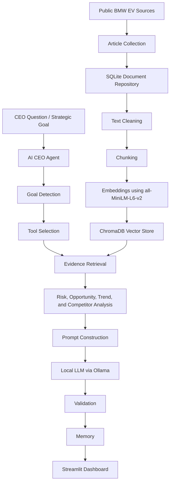
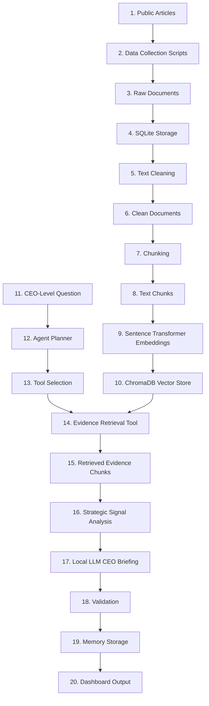

# AI CEO Strategic Intelligence Agent for BMW EV Strategy

## Project Overview

This project is an NLP and Agentic Retrieval-Augmented Generation system built for BMW EV strategy and competitive intelligence.

The system collects public BMW EV-related documents, stores them in a structured knowledge repository, retrieves relevant evidence, analyzes strategic signals, and generates CEO-level recommendations using a controlled AI CEO Agent.

The goal is not only to summarize articles. The goal is to convert public information into evidence-supported strategic insights for executive decision-making.

The system is designed to answer questions such as:

- What should BMW do next in its EV strategy?
- What are BMW's biggest EV market risks?
- What growth opportunities should BMW prioritize?
- How should BMW respond to Tesla, BYD, Mercedes, Audi, and Volkswagen?
- What EV market and technology trends should BMW monitor?
- How should BMW position the Neue Klasse platform?

---

## Selected Company and Business Scope

| Field | Value |
|---|---|
| Company | BMW |
| Industry | Automotive / Electric Vehicles |
| Focus Area | BMW EV strategy and competitive intelligence |
| Main User | CEO / Strategy team / Management decision-maker |
| Main Output | Evidence-based CEO recommendation and executive briefing |

Main focus areas:

- BMW EV strategy
- Neue Klasse platform
- BMW iX3 / future EV positioning
- battery range and charging trends
- competition from Tesla, BYD, Mercedes, Audi, and Volkswagen
- China EV competition
- customer demand and adoption barriers
- profitability, margin pressure, and cost risks
- strategic risks, opportunities, trends, and CEO actions

---

## Current Project Statistics

| Metric | Value |
|---|---:|
| Collected documents | 121 |
| Data sources | 3 |
| Text chunks | 886 |
| Database | SQLite |
| Vector store | ChromaDB |
| Embedding model | all-MiniLM-L6-v2 |
| Local LLM | Qwen2.5:3B via Ollama |
| Dashboard | Streamlit |
| Company | BMW |
| Industry | Automotive / Electric Vehicles |

The main database file is:

```text
data/ai_ceo.db
```

The dashboard does not scrape websites live every time it opens. It works over the stored document repository and vector index.

---

## Data Sources

The system uses public BMW EV and automotive market sources.

| Source | Purpose |
|---|---|
| BMWBlog | BMW product, EV, platform, and brand-specific articles |
| Electrek | EV market, battery, charging, and competitor-related signals |
| CleanTechnica | EV adoption, market trends, sustainability, and technology signals |

This satisfies the requirement of using at least 100 public documents from at least 3 public sources.

---

## System Architecture



---

## Data Flow



The system first builds a knowledge repository from public BMW EV-related documents. When a CEO-level question is asked, the agent detects the goal type, selects tools, retrieves evidence, analyzes the evidence, sends the structured context to the local LLM, validates the output, stores memory, and displays the final answer with trace.

---

## Main Pipeline

The final pipeline is:

```text
Collect → Store → Clean → Chunk → Embed → Retrieve → Analyze → Prompt → Generate → Validate → Save Memory → Display
```

### 1. Data Collection

Public BMW EV-related articles are collected using script-based data collection.

The collected data includes:

- title
- source
- source type
- category
- URL
- article text
- collected date
- metadata

### 2. SQLite Repository

SQLite is used as the structured document repository.

SQLite stores:

- raw documents
- cleaned documents
- chunks
- metadata
- source information
- dashboard statistics
- agent memory

### 3. Text Processing

The preprocessing step prepares collected text for NLP processing.

Main cleaning steps:

- remove noisy text
- normalize spaces
- clean article body
- remove invalid or empty documents
- prepare text for chunking

### 4. Chunking

Clean documents are split into smaller text chunks.

Current chunking setup:

| Setting | Value |
|---|---:|
| Chunk size | 1000 characters |
| Chunk overlap | 150 characters |
| Total chunks | 886 |

Chunking is needed because full articles are too long for direct retrieval and LLM prompting. Smaller chunks make retrieval more focused.

### 5. Embeddings

Each chunk is converted into a semantic vector using:

```text
all-MiniLM-L6-v2
```

This embedding model is lightweight, free, and suitable for local semantic retrieval.

### 6. ChromaDB Vector Store

ChromaDB stores the vector embeddings and supports semantic search.

SQLite and ChromaDB have different roles:

| Component | Role |
|---|---|
| SQLite | Stores documents, metadata, chunks, dashboard information, and memory |
| ChromaDB | Stores embeddings and supports semantic retrieval |

---

## Agentic RAG Workflow

The main AI CEO Agent follows a controlled Agentic RAG workflow:

```text
Goal → Plan → Select Tools → Retrieve Evidence → Analyze Signals → Build Prompt → Generate with LLM → Validate → Save Memory → Return Trace
```

This is more than a normal RAG pipeline.

A basic RAG system retrieves documents and generates an answer. This project adds:

- goal type detection
- planning
- dynamic tool selection
- evidence retrieval
- strategic signal analysis
- local LLM generation
- validation
- memory
- agent trace

The workflow is controlled-dynamic:

- The process structure is fixed for reliability.
- The user goal is dynamic.
- The selected tools depend on the detected goal type.

---

## Goal Types

The planner classifies CEO-level questions into goal types.

| Goal Type | Purpose |
|---|---|
| `strategic_decision` | Broad strategy and executive decision questions |
| `risk_analysis` | Questions focused on risks, barriers, threats, or challenges |
| `opportunity_analysis` | Questions focused on growth opportunities |
| `trend_analysis` | Questions focused on market or technology trends |
| `competitor_analysis` | Questions focused on competitors and market response |

Example:

```text
What should BMW do next in its EV strategy considering competition, market demand, innovation, and strategic risks?
```

Expected goal type:

```text
strategic_decision
```

---

## Tool Selection

The agent selects tools based on the detected goal type.

### Strategic Decision

```text
retrieve_evidence_tool
analyze_risks_tool
analyze_opportunities_tool
analyze_trends_tool
analyze_competitors_tool
generate_recommendation_tool
validate_recommendation_tool
save_memory_tool
```

### Risk Analysis

```text
retrieve_evidence_tool
analyze_risks_tool
analyze_trends_tool
generate_recommendation_tool
validate_recommendation_tool
save_memory_tool
```

### Opportunity Analysis

```text
retrieve_evidence_tool
analyze_opportunities_tool
analyze_trends_tool
generate_recommendation_tool
validate_recommendation_tool
save_memory_tool
```

### Trend Analysis

```text
retrieve_evidence_tool
analyze_trends_tool
analyze_opportunities_tool
generate_recommendation_tool
validate_recommendation_tool
save_memory_tool
```

### Competitor Analysis

```text
retrieve_evidence_tool
analyze_competitors_tool
analyze_risks_tool
generate_recommendation_tool
validate_recommendation_tool
save_memory_tool
```

---

## Agent Tools

The AI CEO Agent uses the following tool-like components:

| Tool / Component | Purpose |
|---|---|
| `retrieve_evidence_tool` | Retrieves relevant evidence chunks from ChromaDB |
| `analyze_risks_tool` | Extracts risk signals from retrieved evidence |
| `analyze_opportunities_tool` | Extracts opportunity signals from retrieved evidence |
| `analyze_trends_tool` | Extracts market and technology trend signals |
| `analyze_competitors_tool` | Extracts competitor-related signals |
| `sentiment_tool` | Calculates sentiment from retrieved evidence using VADER |
| `generate_recommendation_tool` | Builds the LLM prompt and generates the CEO recommendation |
| `validate_recommendation_tool` | Checks the generated output before approval |
| `save_memory_tool` | Saves the agent run for traceability |

The project has one main agent. Planner, tools, validator, and memory are internal components used by that agent.

---

## CEO Recommendation Generation

The final CEO response is generated using a local LLM through Ollama.

Current model:

```text
qwen2.5:3b
```

The agent sends the following information to the LLM:

- user goal
- detected goal type
- retrieved evidence chunks
- risk signals
- opportunity signals
- trend signals
- competitor signals
- sentiment result
- priority
- confidence

The LLM is instructed to use only retrieved evidence and extracted signals. It should not invent unsupported facts.

If Ollama is running correctly, the dashboard shows:

```text
retrieval_augmented_local_llm
```

as the generation mode.

In the final system, the CEO-level answer is generated by the local LLM using retrieved evidence. If the local LLM is not running, the system should not present an unsupported final CEO recommendation.

---

## Validation

After the LLM generates the recommendation, the validator checks the output.

Validation checks include:

- answer exists
- evidence exists
- recommendation is present
- priority is present
- confidence is present
- output is complete enough for dashboard display

If validation passes, the dashboard shows:

```text
Validation passed. Recommendation approved.
```

Validation helps prevent unsupported or incomplete recommendations from being accepted silently.

---

## Agent Memory

Each successful agent run is saved in memory.

Memory stores:

- user goal
- detected goal type
- selected tools
- evidence count
- validation result
- answer preview
- timestamp

Memory is used for traceability and evaluation. It helps show how the agent behaved across different questions.

---

## Dashboard

The project includes a Streamlit dashboard with 8 main tabs.

| Tab | Purpose |
|---|---|
| Overview | Shows repository statistics and project summary |
| Market Intelligence | Shows collected market documents and source information |
| Opportunities | Shows opportunity-dominant documents from the repository |
| Risk Monitor | Shows risk-dominant documents from the repository |
| Sentiment | Shows sentiment over stored documents |
| Strategic Recommendations | Runs the main agent for strategic recommendation questions |
| CEO Briefing | Runs the main agent for executive CEO-level briefing |
| Agent Trace | Shows plan, selected tools, validation, memory, and trace |

---

## Risk Monitor and Opportunity Monitor

Risk Monitor and Opportunity Monitor are supporting analytics views.

They are not the main CEO Agent.

These tabs use the full SQLite document repository and a shared keyword-based classifier.

Each document is classified only once as:

```text
Risk
Opportunity
Neutral
```

The classifier calculates:

- risk keyword score
- opportunity keyword score
- final signal type
- final theme
- matched keywords
- evidence preview

Final assignment logic:

```text
if risk score > opportunity score → Risk
if opportunity score > risk score → Opportunity
otherwise → Neutral
```

This prevents double-counting.

Expected count logic:

```text
Risk Documents + Opportunity Documents + Neutral Documents = Total Documents
```

These monitor tabs are explainable repository-level views that support the main CEO Agent.

---

## Sentiment Analysis

The Sentiment tab uses VADER sentiment analysis.

VADER provides a simple and explainable sentiment baseline over the stored documents.

The sentiment result is used for dashboard-level interpretation and as supporting context for the agent.

---

## Evidence Control

The system reduces hallucination risk by using an evidence-first workflow.

Evidence control is handled through:

- semantic retrieval from ChromaDB
- evidence IDs
- source metadata
- extracted strategic signals
- prompt restrictions
- validation
- supporting evidence tables

The LLM is not used as the source of truth. The source of truth is the retrieved evidence from the stored document repository and vector database.

---

## Technology Stack

| Component | Tool / Library |
|---|---|
| Programming language | Python |
| Dashboard | Streamlit |
| Database | SQLite |
| Vector store | ChromaDB |
| Embedding model | all-MiniLM-L6-v2 |
| Embedding library | Sentence Transformers |
| Local LLM | Qwen2.5:3B via Ollama |
| Sentiment analysis | VADER |
| Data handling | Pandas |
| Visualization | Plotly |
| Web collection support | Requests, BeautifulSoup, Feedparser, Trafilatura |

---

## Design Decisions

| Design Decision | Reason |
|---|---|
| BMW was selected as the company | BMW has active EV strategy, Neue Klasse platform, premium EV positioning, and strong public market coverage |
| SQLite was used | It is lightweight, local, simple to inspect, and suitable for an academic prototype |
| ChromaDB was used | It supports persistent local vector search |
| all-MiniLM-L6-v2 was used | It is free, lightweight, and works well for semantic retrieval |
| One main CEO Agent was used | It keeps the system explainable and easier to debug |
| Custom agent logic was used | It makes planning, tool selection, and validation transparent |
| Ollama was used | It avoids paid LLM APIs and supports local generation |
| Streamlit was used | It is easy to demonstrate and suitable for interactive dashboards |
| VADER was used | It provides a simple explainable sentiment baseline |
| Keyword-based monitor tabs were used | They provide transparent repository-level analytics separate from the main agent |

---

## Project Structure

```text
ai_ceo_agent/
│
├── app.py
├── README.md
├── requirements.txt
├── .gitignore
│
├── agent/
│   ├── __init__.py
│   ├── ai_ceo_agent.py
│   ├── planner.py
│   ├── validator.py
│   └── memory.py
│
├── dashboard/
│   ├── __init__.py
│   ├── common.py
│   └── tabs/
│       ├── __init__.py
│       ├── overview_tab.py
│       ├── market_tab.py
│       ├── opportunity_tab.py
│       ├── risk_tab.py
│       ├── signal_classifier.py
│       ├── sentiment_tab.py
│       ├── recommendations_tab.py
│       ├── ceo_briefing_tab.py
│       └── agent_trace_tab.py
│
├── data/
│   └── ai_ceo.db
│
├── data_collection/
│   ├── __init__.py
│   └── collect_articles.py
│
├── intelligence/
│   ├── __init__.py
│   └── strategic_analyzer.py
│
├── llm/
│   ├── __init__.py
│   └── ollama_client.py
│
├── processing/
│   └── __init__.py
│
├── retrieval/
│   ├── __init__.py
│   ├── build_vector_store.py
│   └── semantic_retriever.py
│
├── scripts/
│   └── checks/
│       ├── check_chunks.py
│       └── check_database.py
│
├── storage/
│   ├── __init__.py
│   └── sqlite_store.py
│
├── tools/
│   ├── __init__.py
│   └── strategic_tools.py
│
└── utils/
    ├── __init__.py
    └── config.py
```

---

## Important Files

| File | Responsibility |
|---|---|
| `app.py` | Main Streamlit dashboard entry point |
| `agent/ai_ceo_agent.py` | Coordinates the full AI CEO Agent workflow |
| `agent/planner.py` | Detects goal type and selects tools |
| `agent/validator.py` | Validates the generated recommendation |
| `agent/memory.py` | Saves agent run history |
| `tools/strategic_tools.py` | Contains retrieval, analysis, recommendation, sentiment, and validation tools |
| `dashboard/tabs/signal_classifier.py` | Shared classifier for Risk and Opportunity monitor tabs |
| `retrieval/semantic_retriever.py` | Retrieves evidence from ChromaDB |
| `retrieval/build_vector_store.py` | Builds vector store from chunks |
| `storage/sqlite_store.py` | SQLite helper functions |
| `utils/config.py` | Project configuration |

---

## How to Run

### 1. Create virtual environment

```powershell
python -m venv .venv
```

### 2. Activate virtual environment

```powershell
.\.venv\Scripts\Activate.ps1
```

### 3. Install dependencies

```powershell
python -m pip install -r requirements.txt
```

### 4. Start Ollama model

Open one terminal and run:

```powershell
ollama run qwen2.5:3b
```

Keep this terminal open.

### 5. Set Python path

Open another terminal in the project root and run:

```powershell
$env:PYTHONPATH = "."
```

### 6. Rebuild vector store if needed

If the `chroma_db/` folder is missing or has to be rebuilt:

```powershell
python -m retrieval.build_vector_store
```

### 7. Test planner

```powershell
python -m agent.planner
```

### 8. Test tools

```powershell
python -m tools.strategic_tools
```

### 9. Compile check

```powershell
python -m compileall app.py agent tools intelligence retrieval processing dashboard llm storage utils
```

### 10. Run dashboard

```powershell
streamlit run app.py
```

---

## Demo Queries

Use these queries to test the system.

### Full Strategic Decision

```text
What should BMW do next in its EV strategy considering competition, market demand, innovation, and strategic risks?
```

Expected goal type:

```text
strategic_decision
```

### Risk Analysis

```text
What are the biggest strategic risks BMW faces in the EV market?
```

Expected goal type:

```text
risk_analysis
```

### Opportunity Analysis

```text
What are the strongest growth opportunities for BMW in electric vehicles?
```

Expected goal type:

```text
opportunity_analysis
```

### Competitor Analysis

```text
How should BMW respond to competition from Tesla, BYD, Mercedes, Audi, and Volkswagen in the EV market?
```

Expected goal type:

```text
competitor_analysis
```

### Trend Analysis

```text
What EV market and technology trends should BMW monitor for its future strategy?
```

Expected goal type:

```text
trend_analysis
```

### Product Strategy

```text
How should BMW position the Neue Klasse platform in its future EV strategy?
```

Expected goal type:

```text
strategic_decision
```

### Final Demo Query

```text
What should BMW do next in its EV strategy considering competition from Chinese EV makers, Neue Klasse innovation, customer demand, and profitability risks?
```

Expected goal type:

```text
strategic_decision
```

---

## Expected Successful Output

For a successful CEO Agent run, the dashboard should show:

- detected goal type
- selected tools
- retrieved evidence chunks
- generation mode
- LLM-generated CEO briefing
- risk signals
- opportunity signals
- trend signals
- competitor signals
- validation result
- saved memory
- supporting evidence
- agent trace

The generation mode should show:

```text
retrieval_augmented_local_llm
```

when Ollama is running correctly.

---

## Evaluation Focus

This project demonstrates:

- public document collection
- SQLite-based document storage
- text cleaning
- chunking
- embedding generation
- vector database retrieval
- Retrieval-Augmented Generation
- custom agent planning
- tool selection
- evidence-grounded strategic analysis
- local LLM generation
- validation
- memory
- dashboard visualization
- explainable risk and opportunity monitoring

---

## Limitations

This is an academic prototype, so it has some limitations:

- The system uses public documents only.
- The dataset is limited to selected public sources.
- The data collection is script-based, not continuous live monitoring.
- Risk and Opportunity monitor tabs use keyword-based repository analytics.
- Goal-type detection is controlled and rule-based.
- Local LLM output quality depends on the installed Ollama model.
- The system supports strategic decision-making but is not a financial forecasting model.
- Generated recommendations should be reviewed by a human before real business use.

---

## Future Improvements

Possible future improvements include:

- add more public sources
- add scheduled data collection
- add hybrid retrieval with BM25 and embeddings
- improve goal-type detection with a trained classifier
- add source freshness weighting
- improve strategic signal ranking
- add PDF export for CEO briefings
- add evaluation metrics for retrieval quality
- add human-labelled validation examples
- represent the workflow using LangGraph nodes in a future version

---

## Viva Explanation

A short explanation for viva:

```text
My project is an AI CEO Strategic Intelligence Agent for BMW EV strategy.

The system collects public BMW EV-related articles, stores them in SQLite, cleans and chunks the text, creates embeddings using all-MiniLM-L6-v2, and stores them in ChromaDB. When a CEO-level question is asked, the AI CEO Agent detects the goal type, selects relevant tools, retrieves evidence, analyzes risks, opportunities, trends, and competitor signals, builds a prompt, sends the evidence to a local LLM through Ollama, validates the generated answer, saves the run in memory, and displays the result with an agent trace in the dashboard.

This is more than a normal RAG system because it includes planning, tool selection, evidence analysis, validation, memory, and traceability.
```

---

## Final Summary

This project demonstrates a complete NLP and Agentic RAG-based Strategic Intelligence Agent for BMW EV strategy.

The system transforms public BMW EV-related information into evidence-based strategic insights, risks, opportunities, trends, competitor signals, and CEO-level recommendations.

The final system is evidence-grounded, explainable, local-LLM based, and suitable as an academic prototype for strategic intelligence and Agentic RAG.